https://www.runoob.com/linux/linux-shell-io-redirections.html

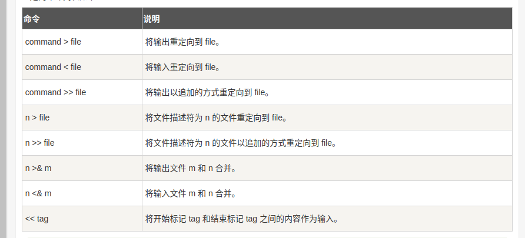

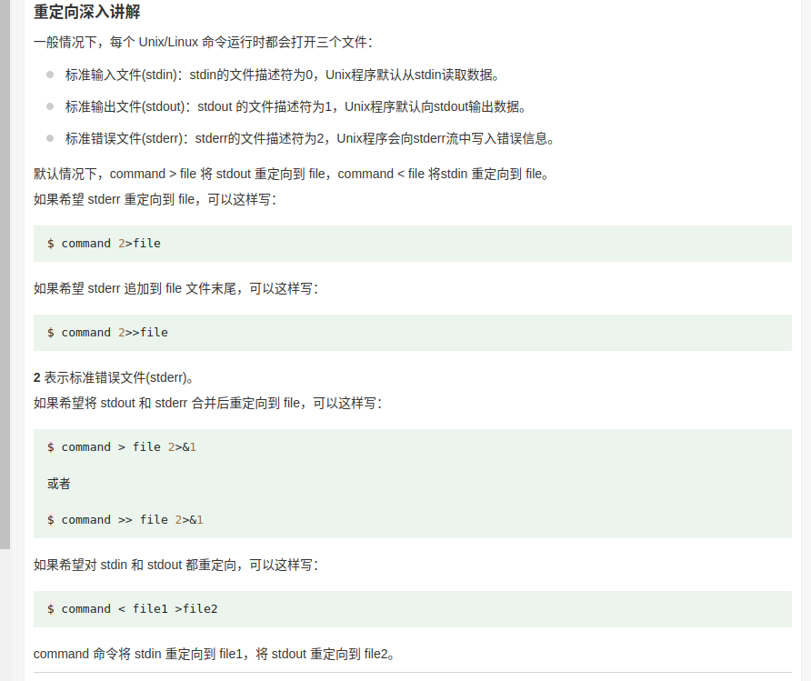

任何重定向都是base on 一个命令的stdin 和 stdout 
后面的后缀都是进行修饰

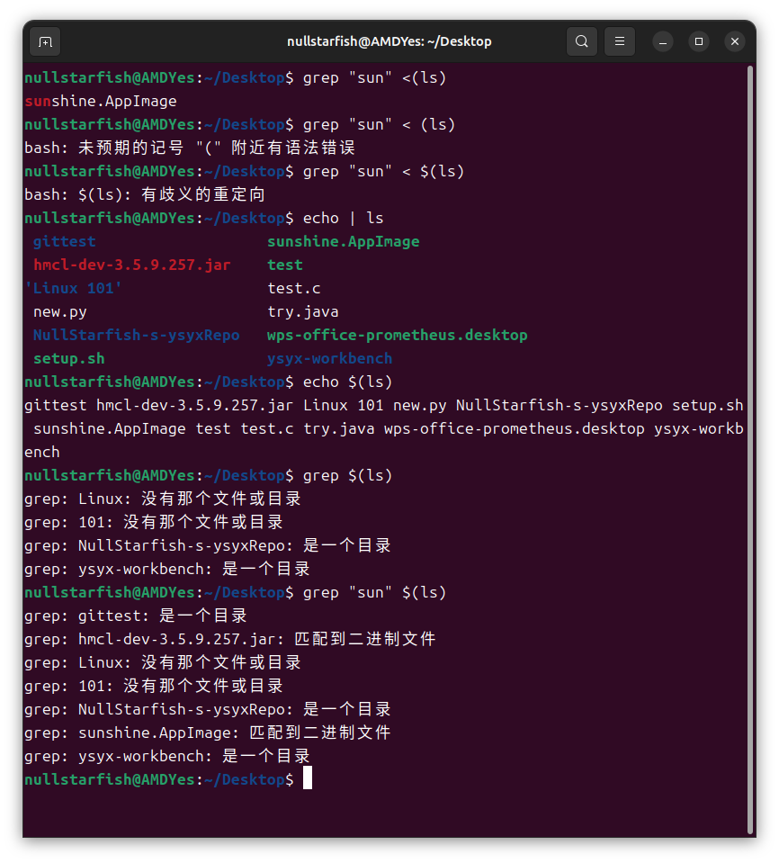

进程替换：
<( CMD )
创建一个临时的文件，将CMD的stdout存进去

重定向 <,>
将一个命令的stdin / stdout 用file来替换
# 注意
重定向的替换是直接类似宏定义的替换：
这意味着如果有空格，可能无法工作
例如cd < file
如果路径中有空格，就会报错
可以这样: cd "$(cat file)"
强制转化为字符串

另外，对于>&
m>&n的意思就是将 m 重定向到n
例如 1>&2就是将1重定向到2

&的意思就是表示后面是文件标识符而非真正的文件
但是 > 之前的数字可以直接写

1>的1可以省略
因此会有
echo "aaa" >&2
的写法：依然是在重定向文件

## stdout ,stdin stderr
这三个都是文件，在/dev/文件夹中
对于stdout 和 stderr，默认都重定向到终端上，
但是实际上，文件不同，
例如：
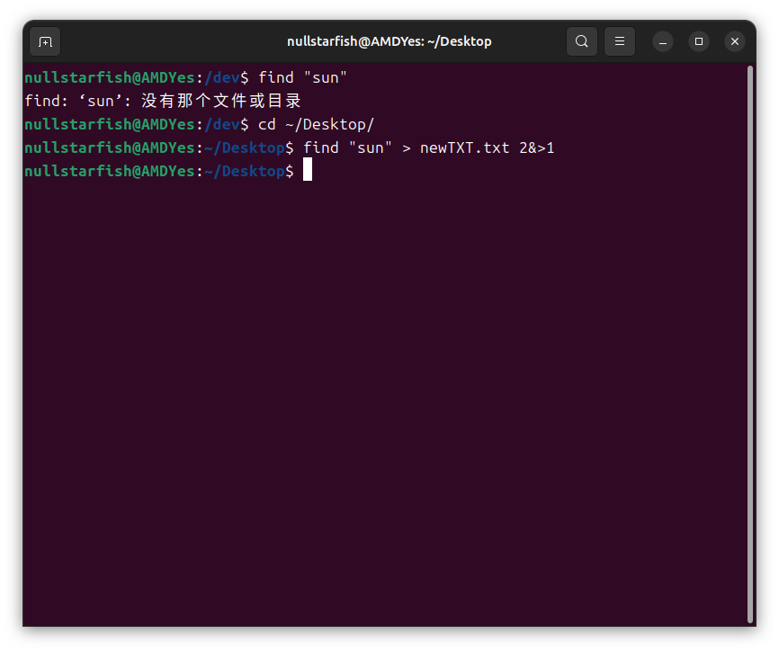
find "sun"执行后
stdout没有输出任何信息，输出的是stderr信息
将stdout重定向到newTXT.txt
将2重定向到1实际上就是把2重定向到newTXT.txt

## 还有一个需要注意的点 顺序问题
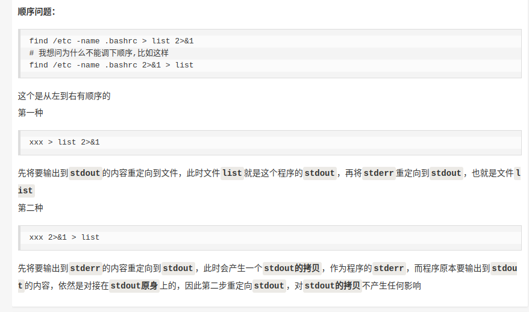
看一下具体的实现过程就明白了

pipe |:
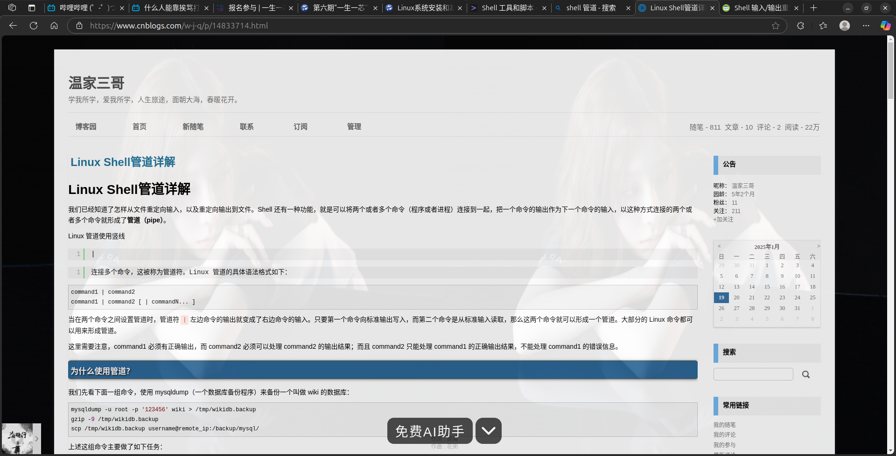
将前一个命令的stdout变成下一个命令的stdin
本质就是创建一个两个进程都能看到的文件
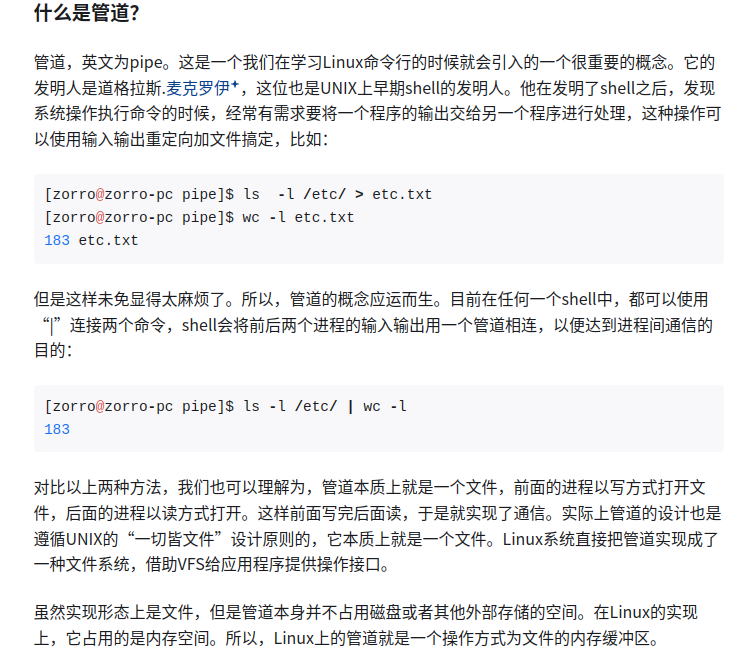
这就是一个<(CMD)的连用

例如 ls | grep 'string'
这样会对文件名进行寻找而非所有文件
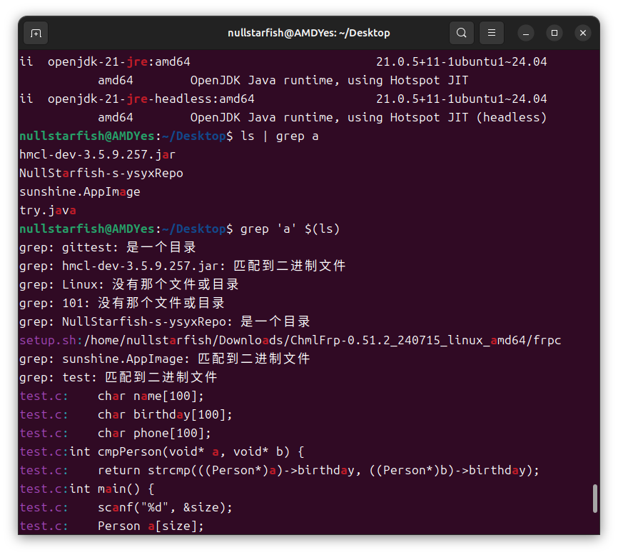
使用
grep 'string' $(ls)
可以解决

另外，介绍find，可以用来进行找文件

还有xargs,可以接收很多参数，将这些参数一个一个地丢给命令
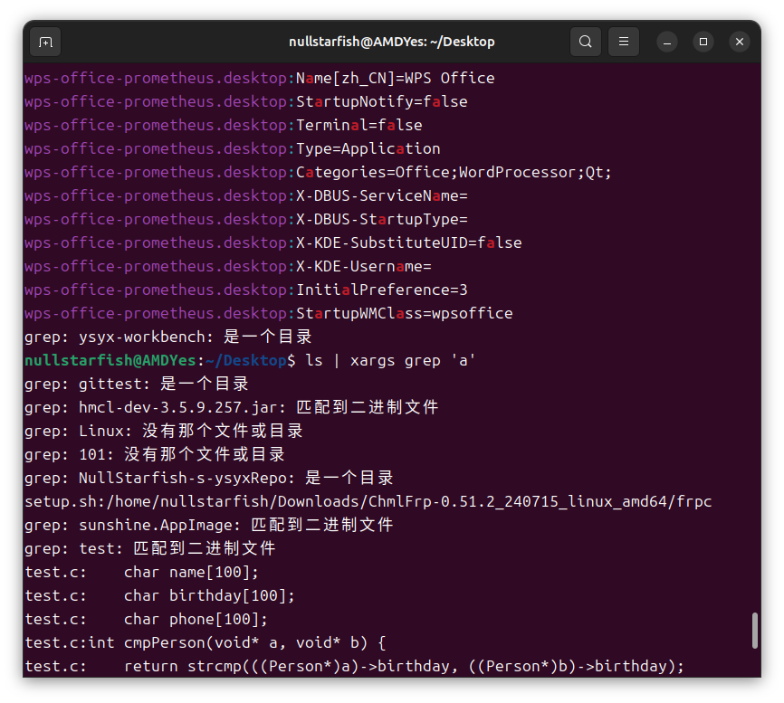
默认都是丢到命令的最后，可以使用-I 加自定义的占为府进行操作例如
ls | xargs -I {} grep 'a' {}

# 注意：
在这里 echo | ls
是因为echo没有参数则没有输出任何stdout，ls也不需要stdin

正确应该是：
echo "$(ls)"
或
cat <(ls)

注意： echo <(ls)是错误的！
grep中的参数不是字符串而是文件名
而echo后面跟的不是文件名

$(CMD):
将CMD的stdout在bash中先给出，这是一种宏定义
是带有空格的，而且不能看作一个字符串

# 实验:
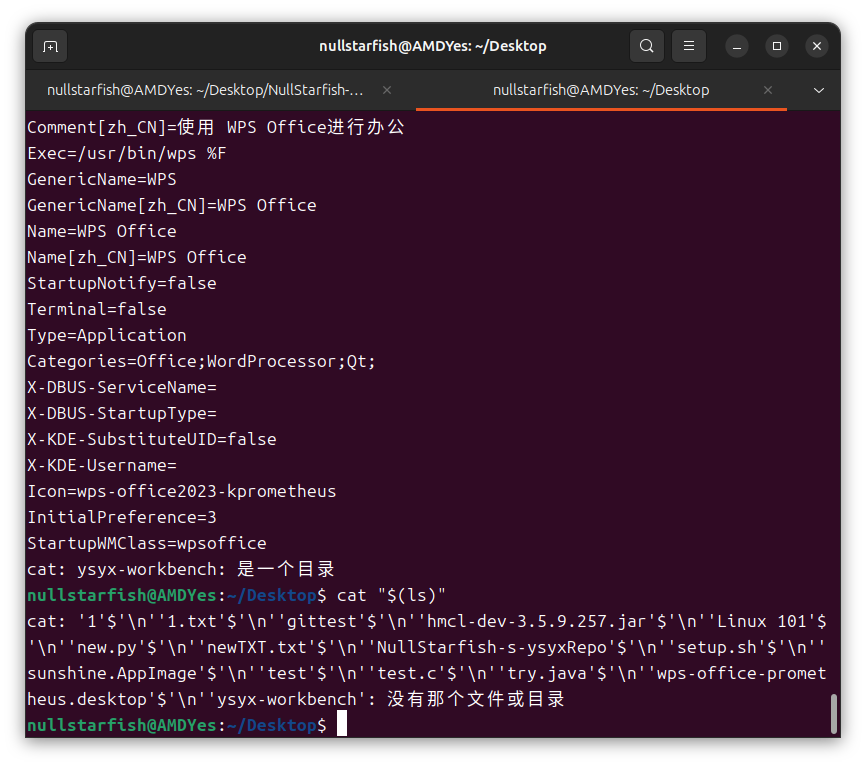
cat可以连续执行，例如
cat 1 2会先cat 1,再cat 2

当我们使用cat $(ls)
会cat所有文件
然而当我们cat "$(ls)"
会报错，因为没有这样一个文件

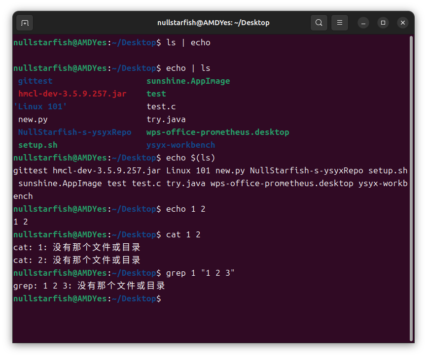
（看最后一行，比较上面的实验）

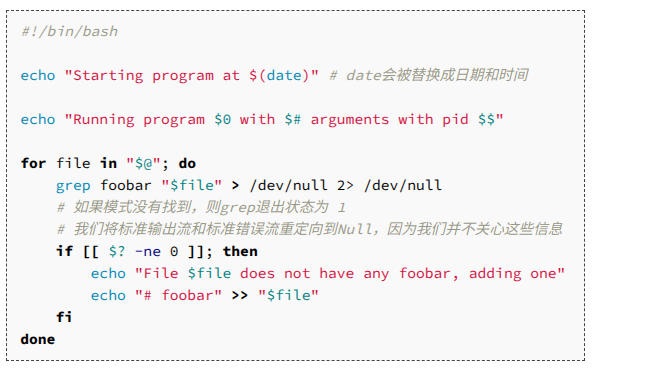

从最后一个echo 看出：
文件并不是一个数据类型，也只是字符串
for file in 
这个file 也只是字符串

平常我们echo 111 > 1.txt
实际上，会自动转化为字符串

